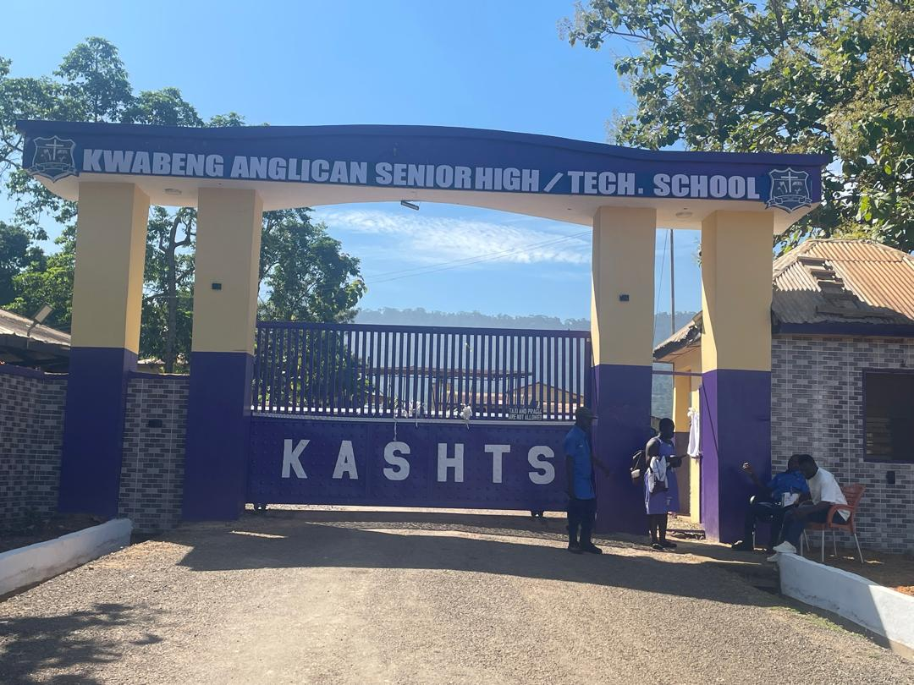
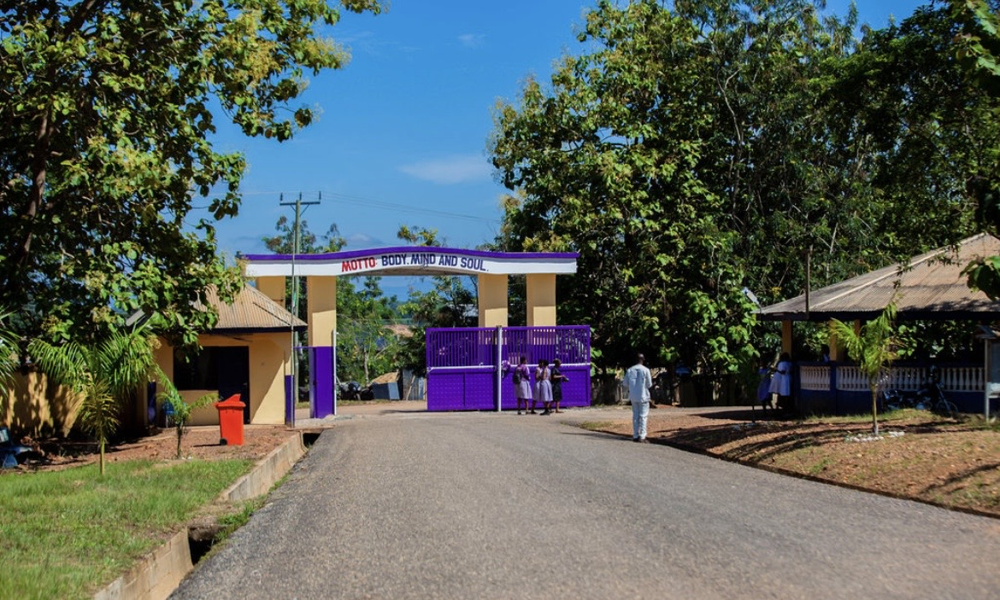

<!DOCTYPE html>
<html lang="en">
<head>
    <meta charset="UTF-8">
    <meta name="viewport" content="width=device-width, initial-scale=1.0">
    <title>Kwabeng Anglican Senior High Technical School</title>
    <!-- FontAwesome for Icons -->
    <link rel="stylesheet" href="https://cdnjs.cloudflare.com/ajax/libs/font-awesome/6.4.0/css/all.min.css">
    
    
</head>
<body>

    <!-- ==================== ANIMATED SPLASH SCREEN ==================== -->
    

        <ul class="slideshow">
            <li></li>
            <li></li>
            <li></li>
        </ul>
        

        

            <!-- Modernized circular crest emblem image placeholder -->
            

                
            

            <h1>Welcome to KASHTS</h1>
            
Body • Mind • Soul
 
            
Kwabeng Anglican Senior High Technical School

            <a href="#main-content" class="enter-btn">
                Enter Website <i class="fa-solid fa-arrow-right" style="margin-left: 8px;"></i>
            </a>
        

    

    <!-- Target element that the splash screen scrolls down to -->
    

    <!-- ==================== YOUR ACTUAL WEBSITE CONTENT ==================== -->
    <header>
        

            <i class="fa-solid fa-school"></i> KASHTS
        

    </header>

    <!-- ABOUT SECTION -->
    <section id="about" class="about">
        
        

            <h2>About KASHTS</h2>
            
Kwabeng Anglican Senior High Technical School (KASHTS) is a Public Category B Senior High Technical School located in Kwabeng, Atiwa District, Eastern Region, Ghana.

            
The school is Anglican and provides quality education, technical skills and character development for students.

        

        

            

                <i class="fa-solid fa-eye"></i>
                <h3>Vision</h3>
                
To create an enabling environment in the school to facilitate effective teaching and learning.

            

            

                <i class="fa-solid fa-star"></i>
                <h3>Mission</h3>
                
To ensure students receive quality education and training through effective management and use of teaching and learning materials.

            

        

        

            <h3>Core Values</h3>
            
Teamwork • Excellence • Godliness • Integrity • Quality

        

    </section>

    <!-- ACADEMICS SECTION -->
    <section id="academics">
        <h2>Academic Programmes</h2>
        

            
General Science

            
General Arts

            
Business

            
Home Economics

            
Visual Arts

            
Technical

            
Agriculture Science

        

    </section>

    <!-- STATISTICS SECTION -->
    <section class="stats">
        

            

                <i class="fa-solid fa-user-graduate"></i>
                <h2>1500+</h2>
                
Students

            

            

                <i class="fa-solid fa-school"></i>
                <h2>1984</h2>
                
Established

            

        

    </section>

    <!-- HEADMISTRESS MESSAGE SECTION -->
    <section class="message">
        
        

            <h2>Headmistress's Message</h2>
            
Welcome to Kwabeng Anglican Senior High Technical School. Our goal is to provide students with quality education, discipline, skills and opportunities that prepare them to become responsible leaders.

            <h3>Miss Elfreda Cecilia Adu Poku <small>Headmistress, KASHTS</small></h3>
        

    </section>

    <!-- NEWS SECTION -->
    <section class="news">
        <h2>Latest News & Events</h2>
        

            

                <i class="fa-solid fa-calendar"></i>
                <h3>Admissions</h3>
                
Join KASHTS and begin your journey of excellence.

            

            

                <i class="fa-solid fa-trophy"></i>
                <h3>Achievements</h3>
                
Celebrating academic and student successes.

            

            

                <i class="fa-solid fa-bullhorn"></i>
                <h3>Announcements</h3>
                
Stay updated with important school information.

            

        

    </section>

    <!-- GALLERY SECTION -->
    <section id="gallery">
        <h2>School Gallery</h2>
        

            
            
            
            
            
            
        

        

            <a href="gallery.html" class="btn" style="text-decoration:none; color:#4A0E77; font-weight:bold;">
                <i class="fa-solid fa-images"></i> View More Images
            </a>
        

    </section>

    <!-- CONTACT SECTION -->
    <section id="contact" class="contact">
        

            <h2>Contact KASHTS</h2>
            
<i class="fa-solid fa-location-dot"></i> Kwabeng, Atiwa District, Eastern Region, Ghana

            
<i class="fa-solid fa-phone"></i> +233 24 461 5726

            
<i class="fa-solid fa-phone"></i> +233 20 555 2735

            
<i class="fa-solid fa-envelope"></i> kwabenganglicanshst@ges.gov.gh

        

    </section>

    <!-- FOOTER SECTION -->
    <footer>
        

            
            <h2>KASHTS</h2>
        

        
&copy; 2026 Kwabeng Anglican Senior High Technical School

        

            <!-- WHATSAPP ANCHOR -->
            <a class="whatsapp" href="https://wa.me/233244615726" target="_blank">
                <i class="fa-brands fa-whatsapp"></i> Chat on WhatsApp
            </a>
        

    </footer>

</body>
</html>
